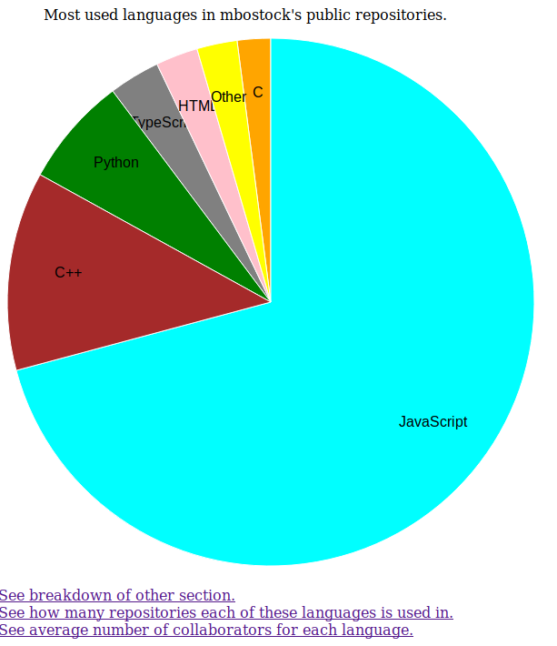
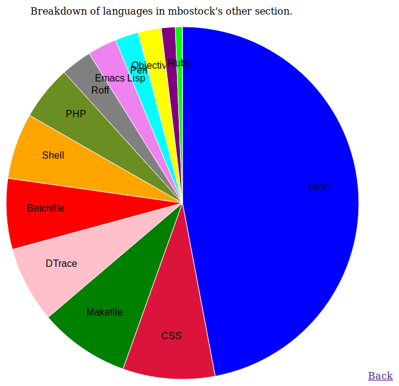
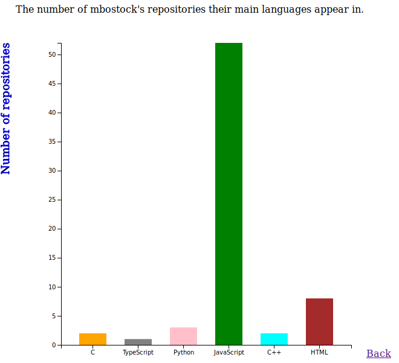
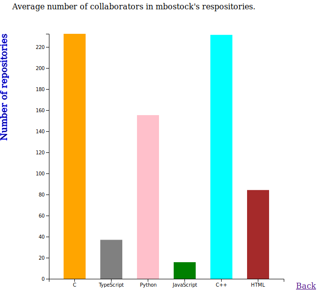

# GitAPIVisual
A Python2 application that collects information about the programming languages used by a developer in their repositories.
It then displays this info in a variety of charts.

To setup install this project and then python flask and PyGithub.

$ pip install Flask
$ pip install PyGithub

Navigate to the program directory and generate information for a user by typing.

$ python app.py username

If you don't include a username it will generate information on Mike Bostock, the creator of d3.js as a demo.
Open the local port it tells you it is running on, with a web browser. 
Since all the information is collected when the program is first run, it might take a while for organisations or users with lots of repositories (about 10-15 seconds for an average user). The good news is once the server is running, there should be no slow down when navigating through the different graphs, using the links on screen.
In the event where you exceed your rate limit. You can pass an access tokken as a second argument in the command line.

You can test parts of the code by with the following command.

$ python testGitRetrieval.py

Unfortunately I ran out of time, before I got to do to everything I wanted. Here is a list of things I would like to add and fix in the future.
* Fix display issue that can causes the labels for different parts of the pie chart to overlap, making the text unreadable.
* Add in a bubble chart for the users languages. It would have number of reposioties as the x-axis, average collaborators as the y-axis and the size of the circles would represent the lines of code. This would effectively allow me to combine together my different graphs and explore the relationship between these properties further.
* Find some way to allow the user to generate results for other github users without restarting the program on the terminal.
* Host the program on a website.

Sample screenshots of the program, with Mike Bostock's stats as of 30/11/18

  

